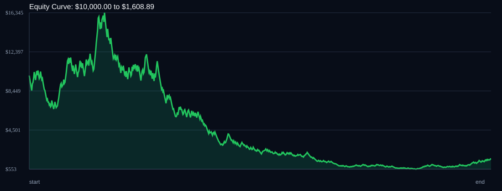

# RSI Divergence Backtest

- Run time: 2026-07-23T13:38:40
- Lookback days: 365
- Starting balance: $10000.0
- Risk per trade idea: 4.0%
- Sizing mode: RISK_PERCENT
- Combined result: $10000.0 -> $1608.89 (-83.91%)
- Combined trades: 736
- Combined win rate: 48.23%
- Combined max drawdown: 96.62%

## Per Symbol

| Symbol | Broker | TF | Mode | Trades | Win % | Return % | Final | DD % | PF | Avg R | Avg Lot | Avg Risk |
|---|---:|---:|---:|---:|---:|---:|---:|---:|---:|---:|---:|---:|
| EURJPY | EURJPY.. | M5 | EMA | 222 | 46.85 | -55.08 | $4491.64 | 72.88 | 0.82 | -0.068 | 2.355 | $258.17 |
| USDSGD | USDSGD.. | M5 | EMA | 514 | 48.83 | -63.98 | $3601.66 | 89.36 | 0.9 | -0.029 | 3.923 | $238.66 |