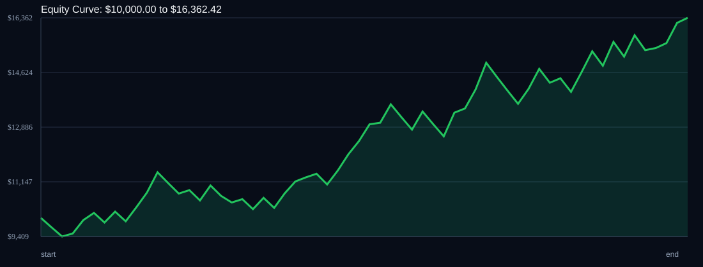

# RSI Divergence Backtest

- Run time: 2026-07-23T13:42:27
- Lookback days: 30
- Starting balance: $10000.0
- Risk per trade idea: 3.0%
- Sizing mode: RISK_PERCENT
- Combined result: $10000.0 -> $16362.42 (63.62%)
- Combined trades: 61
- Combined win rate: 60.66%
- Combined max drawdown: 10.24%

## Per Symbol

| Symbol | Broker | TF | Mode | Trades | Win % | Return % | Final | DD % | PF | Avg R | Avg Lot | Avg Risk |
|---|---:|---:|---:|---:|---:|---:|---:|---:|---:|---:|---:|---:|
| USDSGD | USDSGD.. | M5 | EMA | 43 | 62.79 | 42.97 | $14297.32 | 6.56 | 1.79 | 0.296 | 6.128 | $347.47 |
| EURJPY | EURJPY.. | M5 | EMA | 18 | 55.56 | 14.38 | $11437.67 | 8.72 | 1.55 | 0.273 | 3.563 | $318.04 |