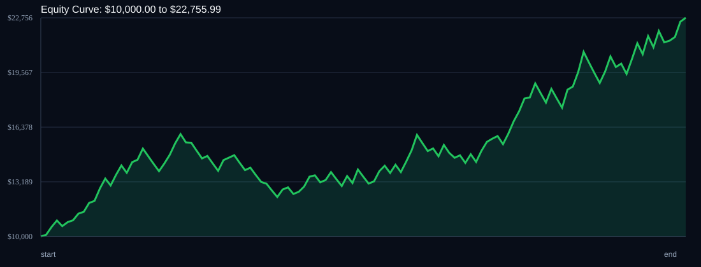

# RSI Divergence Backtest

- Run time: 2026-07-23T13:42:28
- Lookback days: 60
- Starting balance: $10000.0
- Risk per trade idea: 3.0%
- Sizing mode: RISK_PERCENT
- Combined result: $10000.0 -> $22755.99 (127.56%)
- Combined trades: 120
- Combined win rate: 60.0%
- Combined max drawdown: 22.95%

## Per Symbol

| Symbol | Broker | TF | Mode | Trades | Win % | Return % | Final | DD % | PF | Avg R | Avg Lot | Avg Risk |
|---|---:|---:|---:|---:|---:|---:|---:|---:|---:|---:|---:|---:|
| USDSGD | USDSGD.. | M5 | EMA | 85 | 61.18 | 80.6 | $18059.67 | 16.54 | 1.63 | 0.249 | 6.856 | $404.96 |
| EURJPY | EURJPY.. | M5 | EMA | 35 | 57.14 | 25.92 | $12591.76 | 11.13 | 1.5 | 0.241 | 3.743 | $335.93 |