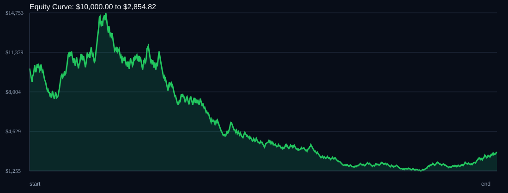

# RSI Divergence Backtest

- Run time: 2026-07-23T13:42:32
- Lookback days: 365
- Starting balance: $10000.0
- Risk per trade idea: 3.0%
- Sizing mode: RISK_PERCENT
- Combined result: $10000.0 -> $2854.82 (-71.45%)
- Combined trades: 736
- Combined win rate: 48.23%
- Combined max drawdown: 91.5%

## Per Symbol

| Symbol | Broker | TF | Mode | Trades | Win % | Return % | Final | DD % | PF | Avg R | Avg Lot | Avg Risk |
|---|---:|---:|---:|---:|---:|---:|---:|---:|---:|---:|---:|---:|
| EURJPY | EURJPY.. | M5 | EMA | 222 | 46.85 | -43.09 | $5690.93 | 61.35 | 0.83 | -0.068 | 1.988 | $216.46 |
| USDSGD | USDSGD.. | M5 | EMA | 514 | 48.83 | -49.55 | $5044.73 | 80.37 | 0.9 | -0.029 | 3.27 | $201.25 |