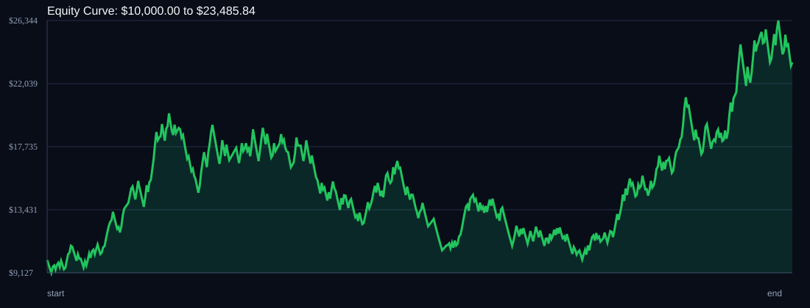

# RSI Divergence Backtest

- Run time: 2026-07-23T13:46:47
- Lookback days: 365
- Starting balance: $10000.0
- Risk per trade idea: 3.0%
- Sizing mode: RISK_PERCENT
- Combined result: $10000.0 -> $23485.84 (134.86%)
- Combined trades: 532
- Combined win rate: 52.44%
- Combined max drawdown: 49.9%

## Per Symbol

| Symbol | Broker | TF | Mode | Trades | Win % | Return % | Final | DD % | PF | Avg R | Avg Lot | Avg Risk |
|---|---:|---:|---:|---:|---:|---:|---:|---:|---:|---:|---:|---:|
| EURJPY | EURJPY.. | M5 | EMA | 273 | 52.38 | 75.82 | $17582.42 | 45.88 | 1.12 | 0.087 | 0 | $0 |
| USDSGD | USDSGD.. | M5 | EMA | 259 | 52.51 | 33.58 | $13358.35 | 34.89 | 1.1 | 0.053 | 0 | $0 |