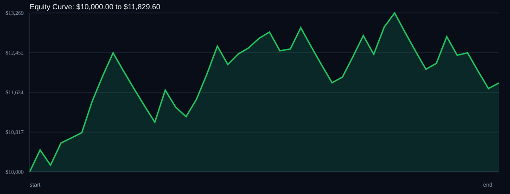

# RSI Divergence Backtest

- Run time: 2026-07-23T13:46:59
- Lookback days: 30
- Starting balance: $10000.0
- Risk per trade idea: 3.0%
- Sizing mode: RISK_PERCENT
- Combined result: $10000.0 -> $11829.6 (18.3%)
- Combined trades: 45
- Combined win rate: 57.78%
- Combined max drawdown: 11.73%

## Per Symbol

| Symbol | Broker | TF | Mode | Trades | Win % | Return % | Final | DD % | PF | Avg R | Avg Lot | Avg Risk |
|---|---:|---:|---:|---:|---:|---:|---:|---:|---:|---:|---:|---:|
| USDSGD | USDSGD.. | M5 | EMA | 22 | 63.64 | 10.51 | $11050.67 | 10.43 | 1.41 | 0.167 | 4.407 | $332.56 |
| EURJPY | EURJPY.. | M5 | EMA | 23 | 52.17 | 7.02 | $10702.17 | 11.47 | 1.19 | 0.117 | 4.636 | $322.92 |