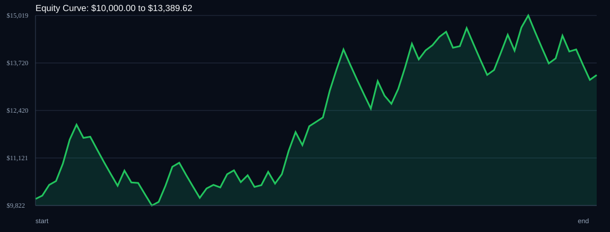

# RSI Divergence Backtest

- Run time: 2026-07-23T13:47:00
- Lookback days: 60
- Starting balance: $10000.0
- Risk per trade idea: 3.0%
- Sizing mode: RISK_PERCENT
- Combined result: $10000.0 -> $13389.62 (33.9%)
- Combined trades: 82
- Combined win rate: 57.32%
- Combined max drawdown: 18.37%

## Per Symbol

| Symbol | Broker | TF | Mode | Trades | Win % | Return % | Final | DD % | PF | Avg R | Avg Lot | Avg Risk |
|---|---:|---:|---:|---:|---:|---:|---:|---:|---:|---:|---:|---:|
| USDSGD | USDSGD.. | M5 | EMA | 43 | 67.44 | 43.54 | $14353.67 | 10.43 | 1.91 | 0.296 | 4.788 | $384.83 |
| EURJPY | EURJPY.. | M5 | EMA | 39 | 46.15 | -6.75 | $9325.4 | 16.15 | 0.89 | -0.042 | 4.253 | $280.35 |