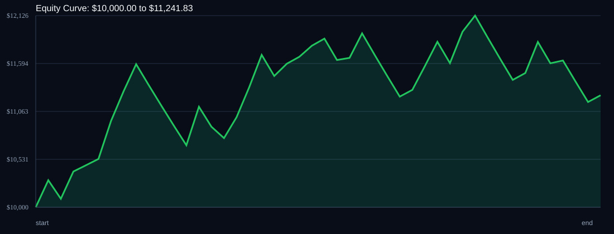

# RSI Divergence Backtest

- Run time: 2026-07-23T13:47:15
- Lookback days: 30
- Starting balance: $10000.0
- Risk per trade idea: 2.0%
- Sizing mode: RISK_PERCENT
- Combined result: $10000.0 -> $11241.83 (12.42%)
- Combined trades: 45
- Combined win rate: 57.78%
- Combined max drawdown: 7.9%

## Per Symbol

| Symbol | Broker | TF | Mode | Trades | Win % | Return % | Final | DD % | PF | Avg R | Avg Lot | Avg Risk |
|---|---:|---:|---:|---:|---:|---:|---:|---:|---:|---:|---:|---:|
| USDSGD | USDSGD.. | M5 | EMA | 22 | 63.64 | 7.1 | $10709.77 | 7.02 | 1.43 | 0.167 | 2.838 | $214.13 |
| EURJPY | EURJPY.. | M5 | EMA | 23 | 52.17 | 4.94 | $10493.58 | 7.74 | 1.21 | 0.117 | 3.015 | $209.97 |