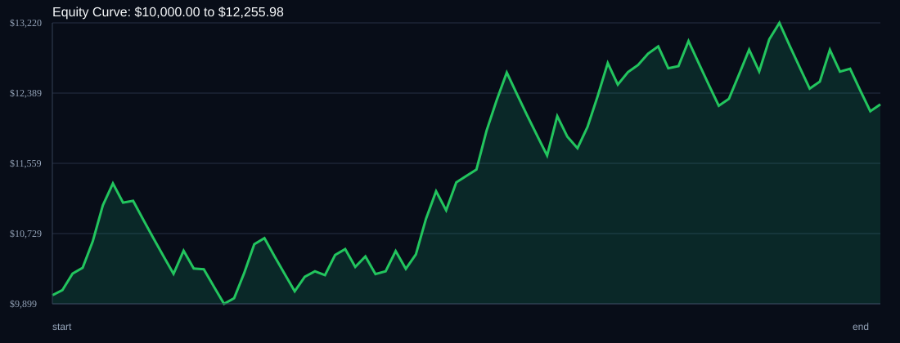

# RSI Divergence Backtest

- Run time: 2026-07-23T13:47:16
- Lookback days: 60
- Starting balance: $10000.0
- Risk per trade idea: 2.0%
- Sizing mode: RISK_PERCENT
- Combined result: $10000.0 -> $12255.98 (22.56%)
- Combined trades: 82
- Combined win rate: 57.32%
- Combined max drawdown: 12.57%

## Per Symbol

| Symbol | Broker | TF | Mode | Trades | Win % | Return % | Final | DD % | PF | Avg R | Avg Lot | Avg Risk |
|---|---:|---:|---:|---:|---:|---:|---:|---:|---:|---:|---:|---:|
| USDSGD | USDSGD.. | M5 | EMA | 43 | 67.44 | 27.73 | $12773.32 | 7.02 | 1.96 | 0.296 | 2.926 | $235.76 |
| EURJPY | EURJPY.. | M5 | EMA | 39 | 46.15 | -4.13 | $9586.51 | 10.96 | 0.9 | -0.042 | 2.894 | $191.33 |