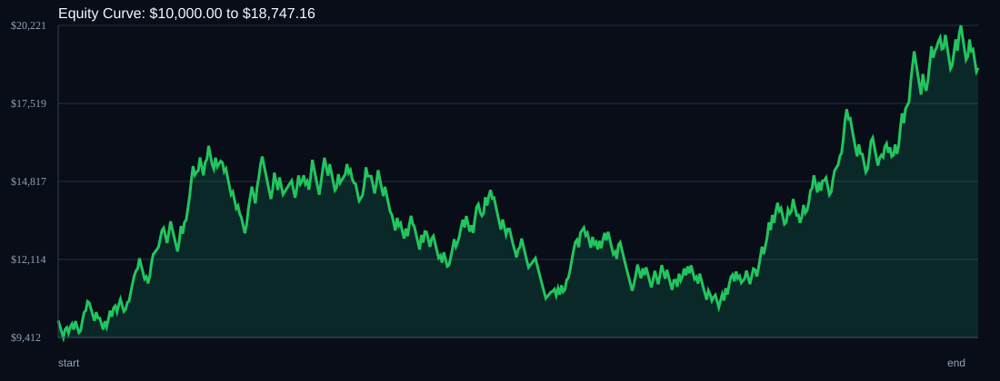

# RSI Divergence Backtest

- Run time: 2026-07-23T13:47:19
- Lookback days: 365
- Starting balance: $10000.0
- Risk per trade idea: 2.0%
- Sizing mode: RISK_PERCENT
- Combined result: $10000.0 -> $18747.16 (87.47%)
- Combined trades: 532
- Combined win rate: 52.44%
- Combined max drawdown: 34.88%

## Per Symbol

| Symbol | Broker | TF | Mode | Trades | Win % | Return % | Final | DD % | PF | Avg R | Avg Lot | Avg Risk |
|---|---:|---:|---:|---:|---:|---:|---:|---:|---:|---:|---:|---:|
| EURJPY | EURJPY.. | M5 | EMA | 273 | 52.38 | 50.18 | $15017.59 | 33.1 | 1.14 | 0.087 | 3.037 | $271.68 |
| USDSGD | USDSGD.. | M5 | EMA | 259 | 52.51 | 24.72 | $12472.06 | 24.29 | 1.11 | 0.053 | 2.443 | $198.11 |