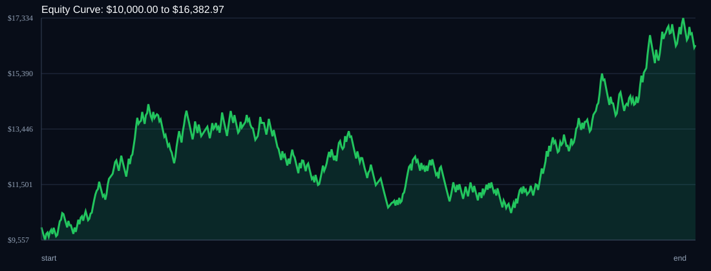

# RSI Divergence Backtest

- Run time: 2026-07-23T13:47:23
- Lookback days: 365
- Starting balance: $10000.0
- Risk per trade idea: 1.5%
- Sizing mode: RISK_PERCENT
- Combined result: $10000.0 -> $16382.97 (63.83%)
- Combined trades: 532
- Combined win rate: 52.44%
- Combined max drawdown: 26.64%

## Per Symbol

| Symbol | Broker | TF | Mode | Trades | Win % | Return % | Final | DD % | PF | Avg R | Avg Lot | Avg Risk |
|---|---:|---:|---:|---:|---:|---:|---:|---:|---:|---:|---:|---:|
| EURJPY | EURJPY.. | M5 | EMA | 273 | 52.38 | 37.33 | $13733.11 | 25.83 | 1.15 | 0.087 | 2.114 | $189.39 |
| USDSGD | USDSGD.. | M5 | EMA | 259 | 52.51 | 19.22 | $11921.75 | 18.61 | 1.12 | 0.053 | 1.84 | $149.35 |