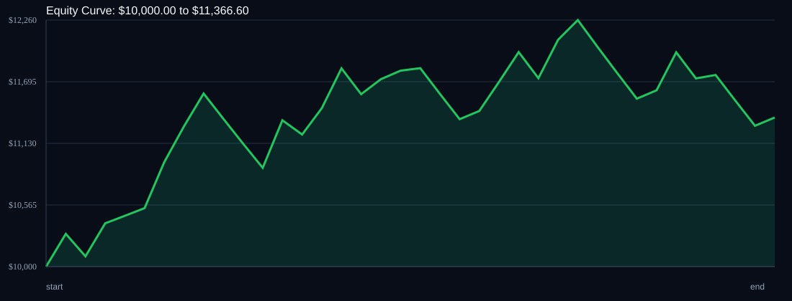

# RSI Divergence Backtest

- Run time: 2026-07-23T13:49:41
- Lookback days: 30
- Starting balance: $10000.0
- Risk per trade idea: 2.0%
- Sizing mode: RISK_PERCENT
- Combined result: $10000.0 -> $11366.6 (13.67%)
- Combined trades: 37
- Combined win rate: 59.46%
- Combined max drawdown: 7.9%

## Per Symbol

| Symbol | Broker | TF | Mode | Trades | Win % | Return % | Final | DD % | PF | Avg R | Avg Lot | Avg Risk |
|---|---:|---:|---:|---:|---:|---:|---:|---:|---:|---:|---:|---:|
| USDSGD | USDSGD.. | M5 | EMA | 22 | 63.64 | 7.1 | $10709.73 | 7.02 | 1.43 | 0.167 | 2.838 | $214.12 |
| EURJPY | EURJPY.. | M5 | EMA | 15 | 53.33 | 6.1 | $10609.66 | 5.87 | 1.4 | 0.211 | 3.319 | $213.42 |