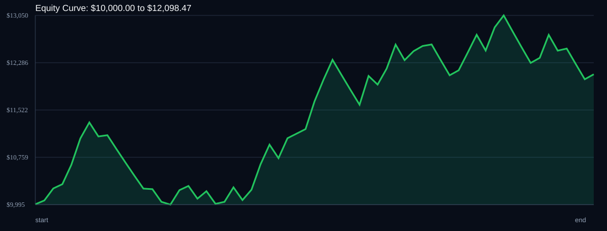

# RSI Divergence Backtest

- Run time: 2026-07-23T13:49:42
- Lookback days: 60
- Starting balance: $10000.0
- Risk per trade idea: 2.0%
- Sizing mode: RISK_PERCENT
- Combined result: $10000.0 -> $12098.47 (20.98%)
- Combined trades: 62
- Combined win rate: 58.06%
- Combined max drawdown: 11.72%

## Per Symbol

| Symbol | Broker | TF | Mode | Trades | Win % | Return % | Final | DD % | PF | Avg R | Avg Lot | Avg Risk |
|---|---:|---:|---:|---:|---:|---:|---:|---:|---:|---:|---:|---:|
| USDSGD | USDSGD.. | M5 | EMA | 38 | 65.79 | 20.03 | $12002.7 | 7.02 | 1.79 | 0.251 | 2.846 | $227.19 |
| EURJPY | EURJPY.. | M5 | EMA | 24 | 45.83 | 0.74 | $10073.91 | 7.48 | 1.03 | 0.028 | 3.277 | $200.19 |