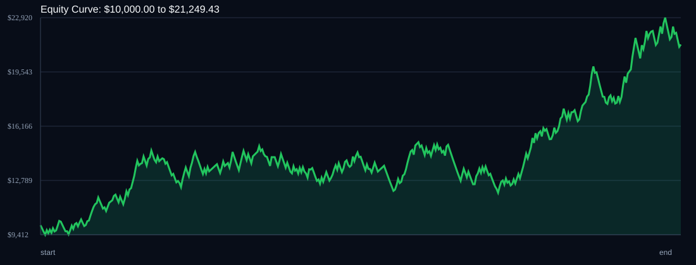

# RSI Divergence Backtest

- Run time: 2026-07-23T13:49:46
- Lookback days: 365
- Starting balance: $10000.0
- Risk per trade idea: 2.0%
- Sizing mode: RISK_PERCENT
- Combined result: $10000.0 -> $21249.43 (112.49%)
- Combined trades: 410
- Combined win rate: 53.9%
- Combined max drawdown: 20.72%

## Per Symbol

| Symbol | Broker | TF | Mode | Trades | Win % | Return % | Final | DD % | PF | Avg R | Avg Lot | Avg Risk |
|---|---:|---:|---:|---:|---:|---:|---:|---:|---:|---:|---:|---:|
| EURJPY | EURJPY.. | M5 | EMA | 203 | 55.17 | 76.05 | $17604.65 | 21.06 | 1.28 | 0.151 | 3.357 | $297.67 |
| USDSGD | USDSGD.. | M5 | EMA | 207 | 52.66 | 20.5 | $12049.95 | 15.92 | 1.12 | 0.056 | 2.384 | $191.5 |