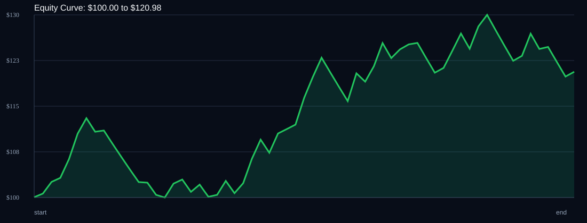

# RSI Divergence Backtest

- Run time: 2026-07-23T13:49:47
- Lookback days: 60
- Starting balance: $100.0
- Risk per trade idea: 2.0%
- Sizing mode: RISK_PERCENT
- Combined result: $100.0 -> $120.98 (20.98%)
- Combined trades: 62
- Combined win rate: 58.06%
- Combined max drawdown: 11.72%

## Per Symbol

| Symbol | Broker | TF | Mode | Trades | Win % | Return % | Final | DD % | PF | Avg R | Avg Lot | Avg Risk |
|---|---:|---:|---:|---:|---:|---:|---:|---:|---:|---:|---:|---:|
| USDSGD | USDSGD.. | M5 | EMA | 38 | 65.79 | 12.25 | $112.25 | 6.85 | 1.55 | 0.251 | 0.023 | $1.82 |
| EURJPY | EURJPY.. | M5 | EMA | 24 | 45.83 | 4.17 | $104.17 | 5.84 | 1.21 | 0.028 | 0.028 | $1.63 |